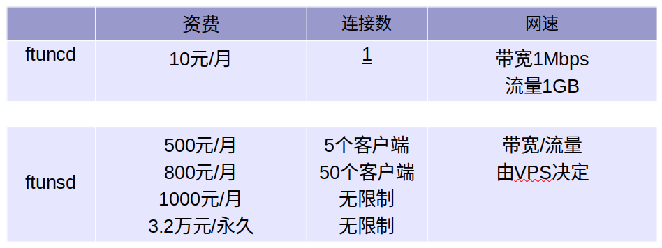

FTUN
==============================

# 为什么使用FTUN

通过在具有公网 IP 的节点上部署 FTUN 服务端，可以轻松地将内网服务穿透到公网，同时提供诸多专业的功能特性，这包括：

客户端服务端通信支持TCP协议。
采用 TCP 连接流式复用，在单个连接间承载更多请求，节省连接建立时间，降低请求延迟。
代理组间的负载均衡。
端口复用，多个服务通过同一个服务端端口暴露。
支持 P2P 通信，流量不经过服务器中转(**对于两端客户网络环境条件苛刻**)，充分利用带宽资源。
高度扩展性的服务端插件系统，易于结合自身需求进行功能扩展。
服务端和客户端 UI 页面。

# 关于购买

疫情之下国内环境不佳,面临生活压力,**决定不再免费提供该软件**,软件分为两部分,可单独购买.

- ftuncd 客户端,**面向偶尔需要使用的用户**.部署在家庭/公司内网的设备上,如采集卡/NAS/视频摄像头,
  **流量经过我的 ftunsd 中转服务器托管,** ftuncd自持连接自己的中转服务器

- ftunsd 中转服务器,**面向企业**.
  自行购买VPS并部署中转服务器,流量安全自己有把握.

**注意** ftunsd 仅提供AMD64/x86版本

[x86/amd64/下载](https://github.com/TeaAndEgg/ftun/releases)
[arm/aarch64下载](https://github.com/TeaAndEgg/ftun/releases)

## 资费

套餐里所指的客户端为 **ftuncd** ,举例:

购买ftunsd 500元/月套餐,同时拥有 10个 ftuncd免费客户端,6个ftuncd同时只有5个能连接ftunsd,
当第6个ftuncd与ftunsd连接后,将 ftunsd 强制随机断开其中一个连接, 6个ftuncd是竞争关系.

# 付费/续费 与联系方式

- **邮件**: egg-software@outlook.com
- **软件发布地址**: https://github.com/TeaAndEgg/ftun
- **付费方式**: 支付前加作者微信, 支付后作者给予token码即可使用.
- **联系作者**: 微信搜索 **cook-egg**

